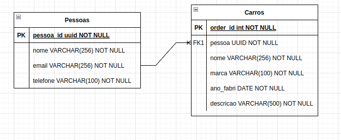

# Bitcars API


## Diagrama de Entidade Relacional


## Documentação 
- [Bitcars API](#bitcars-api)
 - [Create User](#create-user)
  - [Create User Request](#create-user-request)
  - [Create User Response](#create-user-response)
 - [Get All Users](#get-users)
  - [Get All Users Request](#get-users-request)
  - [Get All Users Response](#get-users-response)
 - [Get One User](#get-one-user)
  - [Get One User Request](#get-one-user-request)
  - [Get One User Response](#get-one-user-response)
 - [Patch User](#patch-user)
  - [Patch User Request](#patch-user-request)
  - [Patch User Response](#patch-user-response)
 - [Delete User](#delete-user)
  - [Delete User Request](#delete-user-request)
  - [Delete User Response](#delete-user-response)
 - [Create Car](#create-car)
  - [Create Car Request](#create-car-request)
  - [Create Car Response](#crate-car-response)
 - [Get All Cars](#get-cars)
  - [Get All Cars Request](#get-cars-request)
  - [Get All Cars Response](#get-cars-response)
 - [Get One Car](#get-one-car)
  - [Get One Car Request](#get-one-car-request)
  - [Get One Car Response](#get-one-car-response)
 - [Patch Car](#patch-car)
  - [Patch Car Request](#patch-car-request)
  - [Patch Car Response](#patch-car-response)
 - [Delete Car](#delete-car)
  - [Delete Car Request](#delete-car-request)
  - [Delete Car Response](#delete-car-response)


```yml
Location: http://localhost:3000
```

## Create User
```js
POST /users
```

### Create User Request

```json
{
    "name":"Satoshi Nakamoto",
    "email":"satoshi@bitcoin@mail.com",
    "tel":"(91)31415-9227"
}
```

### Create User Response

```js
201 Created
```

```json
{   
    "id":"2bc37aee-dec8-4b7f-a7df-228677fdfb92",
    "name":"Satoshi Nakamoto",
    "email":"satoshi@bitcoin@mail.com",
    "tel":"(91)31415-9227",
    "carros":[]
}
```

## Get Users

### Get Users Request

```js
GET /users
```

### Get Users Response

```js
200 Ok
```

```json
[
  {   
    "id":"2bc37aee-dec8-4b7f-a7df-228677fdfb92",
    "name":"Satoshi Nakamoto",
    "email":"satoshi@bitcoin.com",
    "tel":"(91)31415-9227",
    "carros":[]
    }
]

```

## Get One User

### Get One User Request

```js
GET /users/:id
```

### Get One User Response

```js
200 Ok
```

```json
{   
    "id":"2bc37aee-dec8-4b7f-a7df-228677fdfb92",
    "name":"Satoshi Nakamoto",
    "email":"satoshi@bitcoin.com",
    "tel":"(91)31415-9227",
    "carros":[]
}

```

## Patch User

### Patch User Request

```js
PATCH /users/:id
```

```json
{
    "name":"Hal Finney",
    "email":"hal@bitcoin.com",
    "tel":"(91)31415-9227"
}

```

### Patch User Response

```js
200 Ok
```

```json
{
    "id":"2bc37aee-dec8-4b7f-a7df-228677fdfb92",
    "name":"Hal Finney",
    "email":"hal@bitcoin.com",
    "tel":"(91)31415-9227",
    "carros":[]
}

```

## Delete User

### Delete User Request

```js
DELETE /users/:id
```

### Delete User Response

```js
204 No content
```

## Create Car

### Create Car Request

```js
POST /cars
```

```json
{
"donoId":"2cd4499c-036b-46b4-86f3-a070ac6dc452",
"name":"Prisma",
"marca":"Chevrolet",
"ano_fabri":"2019",
"descricao":"Eficiente, oferece uma experiência bem melhor de condução do que a dos concorrentes com câmbio automatizado."
}
```

### Create Car Response

```js
201 Ok
```

```json
{
  "id": "3da8a629-ed2e-4134-ae4b-ea4881cca1f9",
  "donoId": "2cd4499c-036b-46b4-86f3-a070ac6dc452",
  "name": "Prisma",
  "marca": "Chevrolet",
  "ano_fabri": "2019",
  "descricao": "Eficiente, oferece uma experiência bem melhor de condução do que a dos concorrentes com câmbio automatizado.",
  "dono": {
    "name":"Satoshi Nakamoto",
    "email":"satoshi@bitcoin@mail.com",
    "tel":"(91)31415-9227"
}
}
```

## Get Cars


### Get Cars Request

```js
GET /cars
```

### Get Cars Response

```js
200 Ok
```
```json
[
    {
  "id": "3da8a629-ed2e-4134-ae4b-ea4881cca1f9",
  "donoId": "2cd4499c-036b-46b4-86f3-a070ac6dc452",
  "name": "Prisma",
  "marca": "Chevrolet",
  "ano_fabri": "2019",
  "descricao": "Eficiente, oferece uma experiência bem melhor de condução do que a dos concorrentes com câmbio automatizado.",
  "dono": {
    "name":"Satoshi Nakamoto",
    "email":"satoshi@bitcoin@mail.com",
    "tel":"(91)31415-9227"
    }
  }   
]
```
## Get One Car

### Get One Car Request

```js
GET /cars/:id
```

### Get One Car Response
```js
200 Ok
```
```json
 {
  "id": "3da8a629-ed2e-4134-ae4b-ea4881cca1f9",
  "donoId": "2cd4499c-036b-46b4-86f3-a070ac6dc452",
  "name": "Prisma",
  "marca": "Chevrolet",
  "ano_fabri": "2019",
  "descricao": "Eficiente, oferece uma experiência bem melhor de condução do que a dos concorrentes com câmbio automatizado.",
  "dono": {
    "name":"Satoshi Nakamoto",
    "email":"satoshi@bitcoin@mail.com",
    "tel":"(91)31415-9227"
    }
  }   

```

## Patch Car

### Patch Car Request

```js
PATCH /cars/:id
```

```json
    {
  "name": "Onix"
    }

```

### Patch Car Response

```js
200 Ok
```

```json
{
  "id": "3da8a629-ed2e-4134-ae4b-ea4881cca1f9",
  "donoId": "2cd4499c-036b-46b4-86f3-a070ac6dc452",
  "name": "Onix",
  "marca": "Chevrolet",
  "ano_fabri": "2019",
  "descricao": "Eficiente, oferece uma experiência bem melhor de condução do que a dos concorrentes com câmbio automatizado.",
  "dono": {
    "name":"Satoshi Nakamoto",
    "email":"satoshi@bitcoin@mail.com",
    "tel":"(91)31415-9227"
    }
  }   

```

## Delete Car

### Delete Car Request

```js
DELETE /cars/:id
```
### Delete Car Response

```js
204 No Content
```
